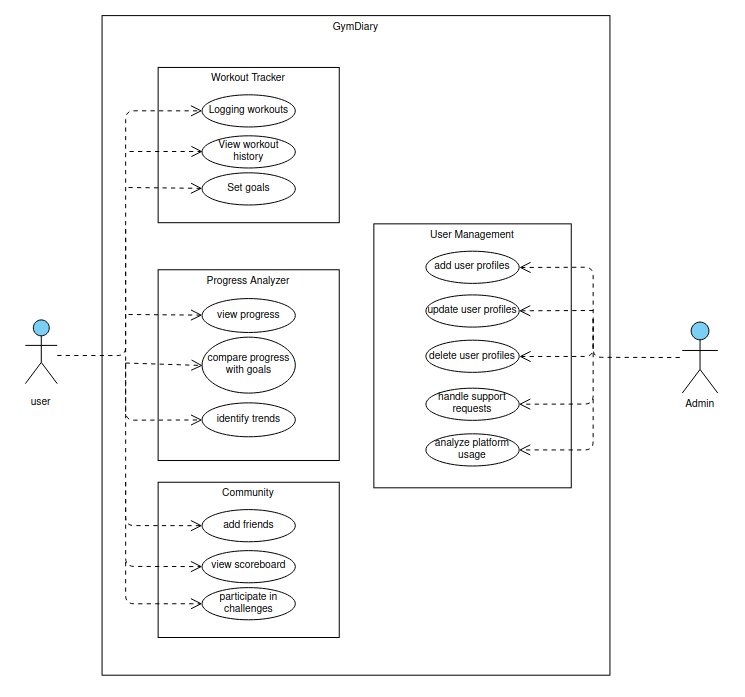
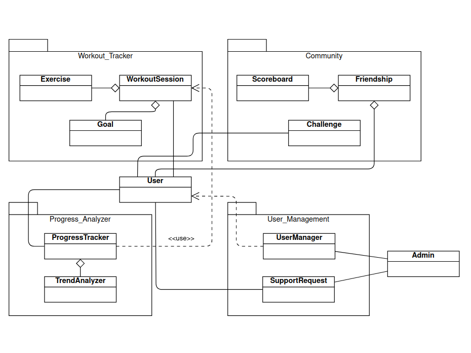

# GymDiary

## Project definition and objectives
GymDiary is a user-friendly fitness web app that aids you in recording and tracking workouts effectively. It suits both experienced gym-goers and beginners. The app allows you to log your workouts, including sets and weight used. It offers an easy way to monitor progress over time. You can set goals and stay motivated to achieve your fitness objectives. GymDiary is the digital solution to replacing traditional pen and paper tracking, making it a more efficient way to track your fitness journey.

## Top-Level Architecture

## Use Case

## Class diagram

## How to run the application
- create your own virtual environment
  - python -m venv [virtual environment name]
- download dependencies
  - open command line interface, go to GymDiary directory and type the following: pip install -r requirements.txt
- Run the server with: python manage.py runserver
- the program should be running in localhost:8000/